# 2D-TopDownShooter
This game is purely written in GameMaker Studio 2 language, and was one of my own summer projects I had in 2017. Unfortunately, all code and content is locked by GameMaker 2 Policies (.gml and .yy file format) which I did not think about at the time. However, this is a preview of the work I did.

Top achievements:

#1 Maps:
* Built out of a tilesystem, containing only of self-made enviorment sprites.

#2 Player features:
* 4-axis movement control.
* Rolling script.
* Dashing script.
* Shooting.

#3 Enemie features:
* Maze-solving scripts to choose shortest path to player unit.
* Aim scripts for predicting where player will move next.
* Hiding scipt, walks behind covering walls and then idles when player is in sight, moves out when player is close enough.

#4 Camera/Player View:
* Follow player coordinates.
* Shake effect when entering boss area.
* Transitionings, fade outs/ins and slideshow effect.

#5 Sprites for game content (All self-made):

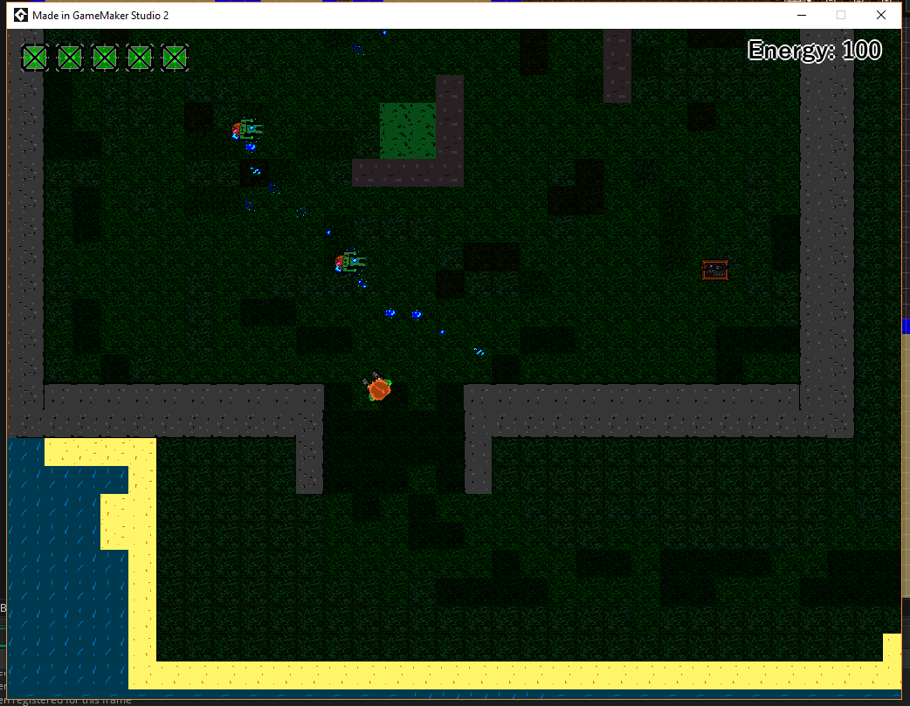

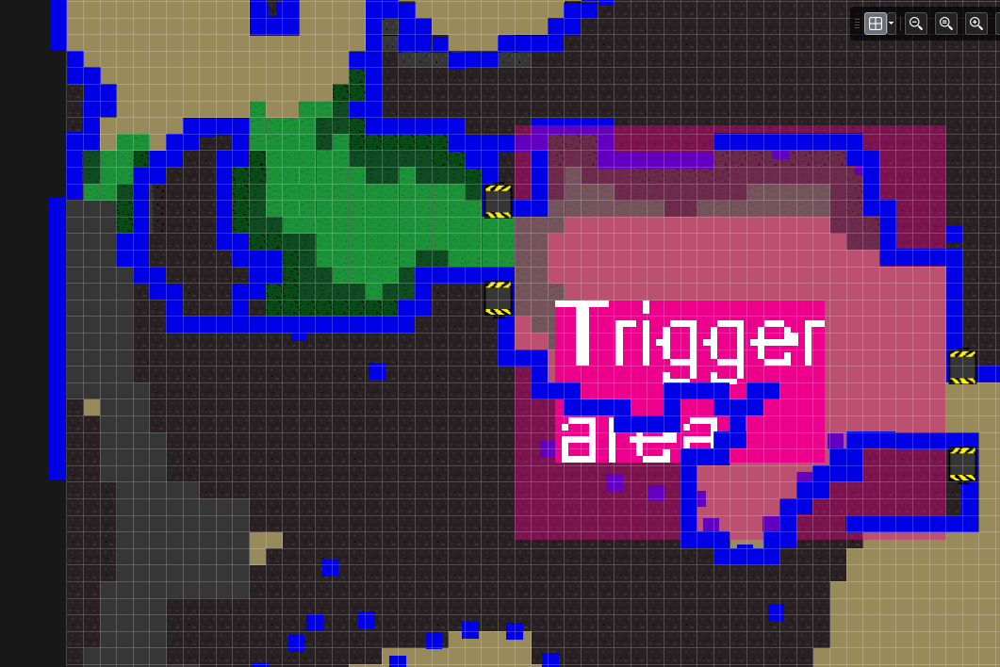

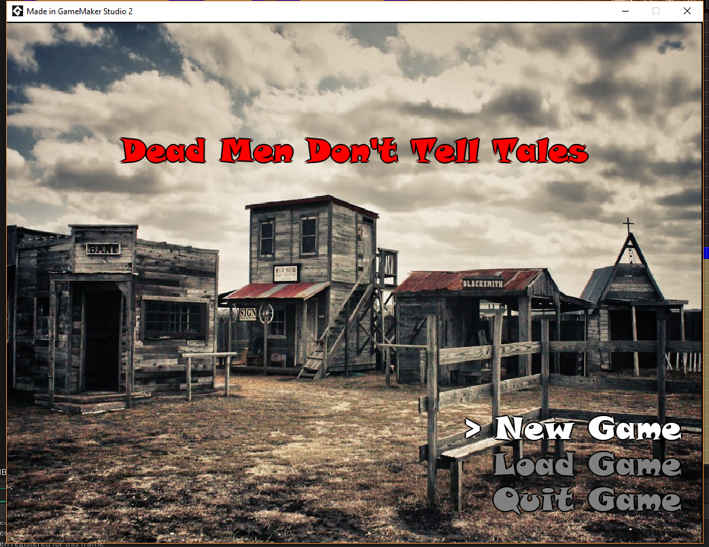

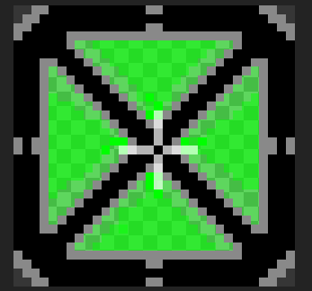

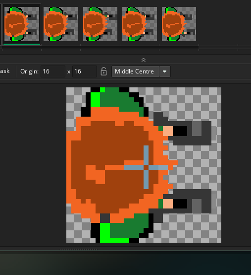

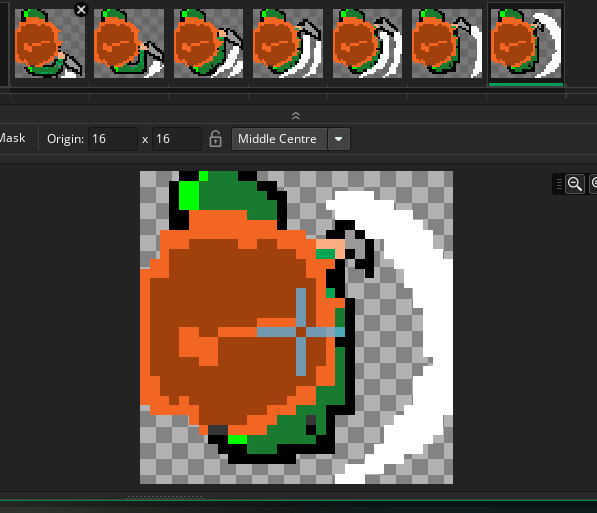

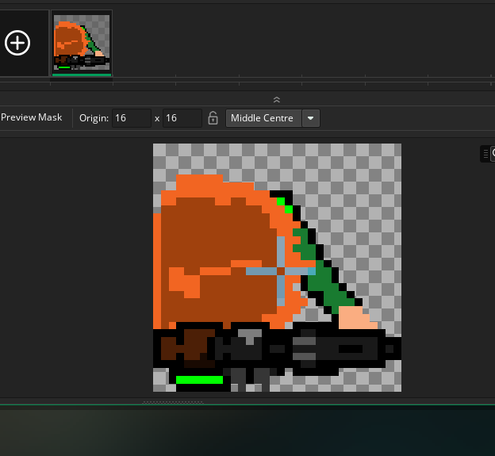

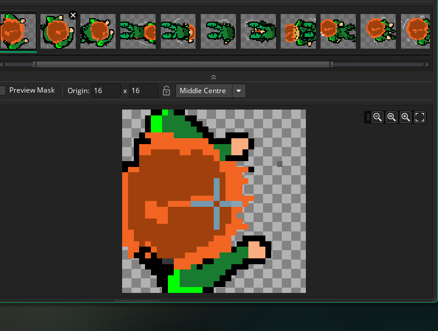

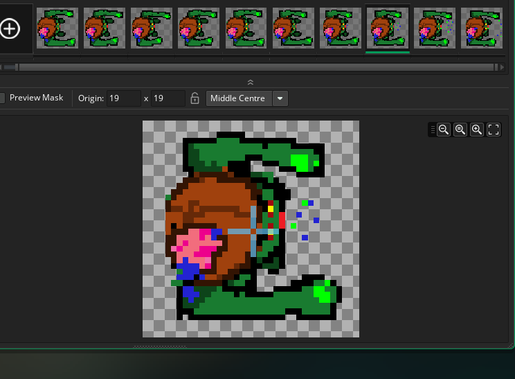

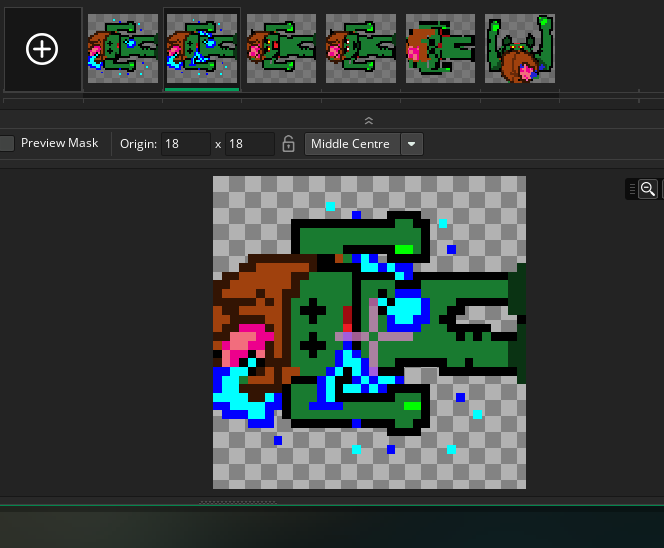

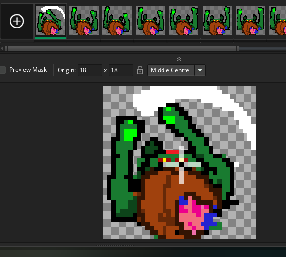

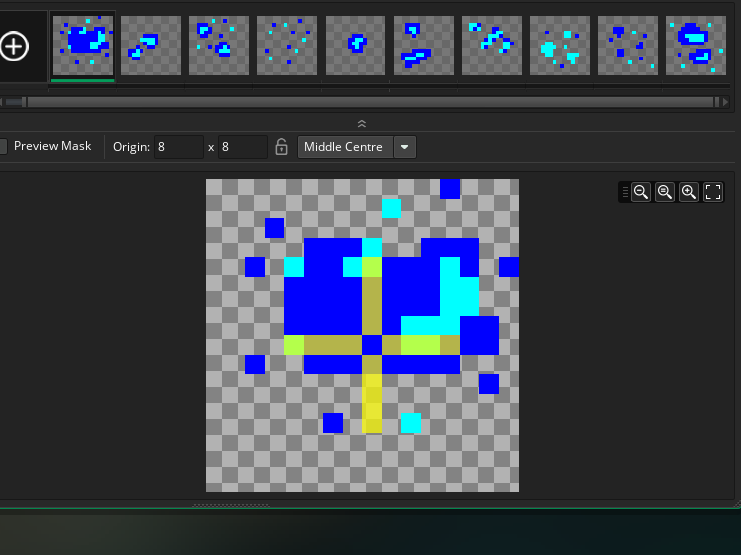

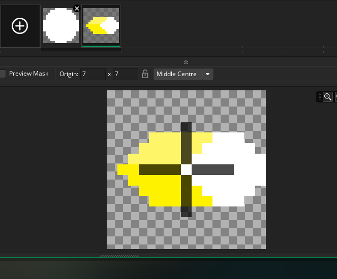

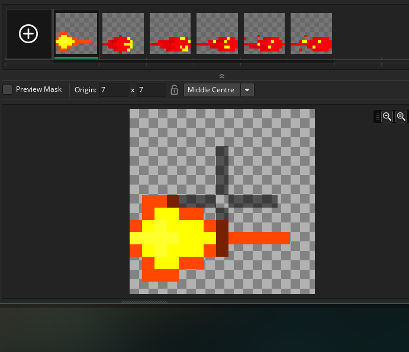

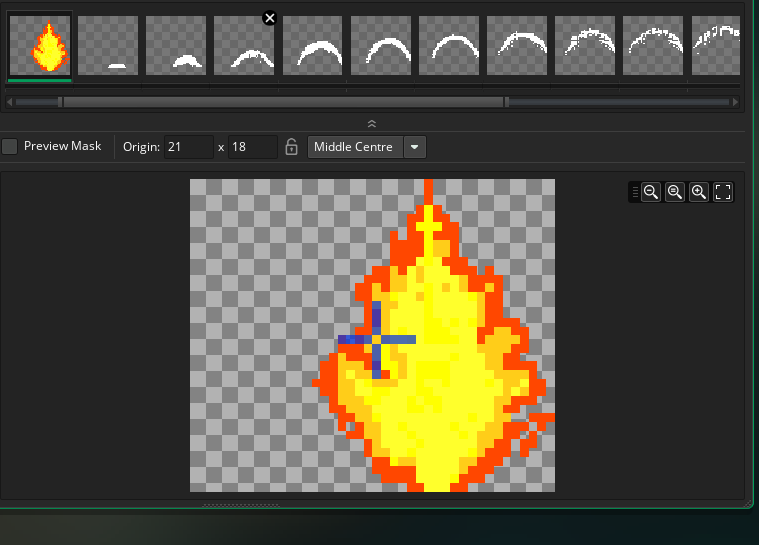
